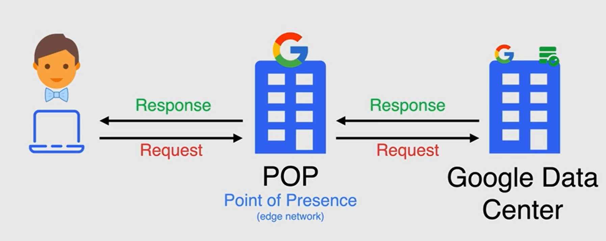

# GoogleCloudLearning
My Whole Google Cloud Learning Journey....

## What is Cloud Computing?
Cloud computing is the on-demand delivery of IT resources over the Internet with pay-as-you-go pricing. Instead of buying, owning, and maintaining physical data centers and servers, you can access technology services, such as computing power, storage, and databases, on an as-needed basis from a cloud provider

## Google Cloud Certifications

## Types of Cloud Computing Services
### Infrastructure as a service (IaaS)
In this type of cloud computing, the cloud service provider offers virtualized computing resources such as servers, storage, and networking infrastructure over the internet.
In more simple terms, IaaS is like renting a virtual computer over the internet. You don't have to worry about buying and maintaining the hardware, as the cloud provider takes care of that. Instead, you can focus on installing your own operating system, applications, and data, just as you would on a physical computer.
IaaS is useful for businesses and organizations that need to quickly scale up or down their computing infrastructure to meet changing demands, without having to make large investments in hardware and software. It also provides flexibility, as customers can choose the computing resources they need, such as CPU, RAM, and storage, and pay only for what they use. This makes IaaS a cost-effective option for businesses of all sizes.

### Platform as a service (PaaS)
PaaS stands for Platform as a Service, which is a type of cloud computing service where a cloud provider offers a complete platform for customers to develop, run, and manage their own applications without having to worry about the underlying infrastructure.
In simpler terms, PaaS is like renting a platform for application development over the internet. The cloud provider offers an operating system, programming language, and database, as well as other tools and services to help developers build and deploy their applications. Customers can focus on developing their applications and not worry about the underlying infrastructure, as the cloud provider takes care of that.
PaaS is useful for businesses and developers who want to build and deploy applications quickly, without having to manage the underlying infrastructure. PaaS provides a complete development environment, including development tools, libraries, and frameworks, which can speed up application development and reduce time-to-market. PaaS also allows developers to collaborate on projects in real-time and access resources from anywhere with an internet connection.
Overall, PaaS offers a cost-effective solution for businesses and developers, as they can pay for only the resources they need and scale up or down as required, without having to invest in expensive hardware and software.

### Software as a service (SaaS)
SaaS stands for Software as a Service, which is a type of cloud computing service where a cloud provider offers complete applications that are delivered over the internet. Customers can access and use these applications through a web browser or a mobile app, without having to install or maintain any software on their own devices.
In simpler terms, SaaS is like renting an application over the internet. The cloud provider hosts the application on its own servers and customers can access it through a web browser or mobile app, without having to worry about installing or maintaining the software on their own devices.
SaaS is useful for businesses and individuals who want to use an application without having to install or manage it themselves. Examples of SaaS applications include email, CRM, and collaboration tools like Google Docs and Microsoft Office 365. SaaS applications can be accessed from anywhere with an internet connection and on any device, making them convenient and accessible for users.

## Types of Clouds:
There are several types of cloud computing services, each with its own characteristics and benefits. Here are some of the most common types of cloud:
  1.	**Public Cloud:** A public cloud is a type of cloud computing service that is available to the general public over the internet. The cloud provider hosts the computing resources and infrastructure and customers can access them through a web browser or API. Examples of public cloud providers include Amazon Web Services (AWS), Microsoft Azure, and Google Cloud Platform.
  2.	**Private Cloud:** A private cloud is a type of cloud computing service that is dedicated to a single organization or business. The computing resources and infrastructure are hosted on-premises or in a third-party data center, and the organization has complete control over the environment. Private clouds are often used by large enterprises and government agencies that have strict security and compliance requirements.
  3.  **Hybrid Cloud:** A hybrid cloud is a type of cloud computing service that combines both public and private cloud services. Organizations can use a mix of on-premises and cloud resources to meet their computing needs, and data and applications can be moved between the different environments as needed. Hybrid clouds provide flexibility and scalability, as well as the ability to keep sensitive data and applications on-premises.
  4.  **Multi-Cloud:** A multi-cloud is a type of cloud computing service that involves using multiple cloud providers for different computing needs. This can provide organizations with better performance, cost savings, and redundancy. However, managing multiple cloud providers can be complex, and organizations need to ensure that they have the right tools and processes in place to manage their multi-cloud environments effectively.
  5.  **Community Cloud:** A community cloud is a type of cloud computing service that is shared by multiple organizations with similar computing needs. The computing resources and infrastructure are hosted by a third-party provider, and the organizations share the costs and management responsibilities. Community clouds are often used by organizations in the same industry or with similar compliance requirements.

## Point of Presence (PoP)
Google Cloud Platform (GCP) has a global network of points of presence (PoPs) that are used to deliver Google Cloud services to users around the world. PoPs are physical locations where Google has deployed its network infrastructure. They are typically located in data centers or colocation facilities.

PoPs are used to improve the performance and reliability of Google Cloud services. By colocating its network infrastructure with other network providers, Google can reduce the distance that data has to travel, which can improve performance. PoPs also help to improve reliability by providing redundancy in case of a network outage.
GCP has PoPs in over 200 countries and territories. This allows Google to deliver its services to users with low latency and high availability.

Here are some of the benefits of using GCP PoPs:
- **Performance:** PoPs can improve the performance of Google Cloud services by reducing the distance that data has to travel. This can be especially beneficial for applications that require low latency, such as gaming and video streaming.
- **Reliability:** PoPs can improve the reliability of Google Cloud services by providing redundancy in case of a network outage. This can be especially beneficial for mission-critical applications.
- **Security:** PoPs can improve the security of Google Cloud services by providing physical security for the network infrastructure. This can help to protect customer data from unauthorized access.

## Zones, Regions and Multi-Regions
In Google Cloud Platform (GCP), zones and regions are geographical concepts used to define the physical locations of resources and data centers within the GCP infrastructure.

**Zones:** A zone is an isolated deployment area within a region. It represents a specific data center or cluster of data centers within a given region. Each zone is designed to be independent and isolated from failures in other zones, providing high availability and fault tolerance. Within a zone, you can deploy various resources such as virtual machine instances, disks, and network resources.

**Regions:** A region is a specific geographical location where GCP resources are available. It is a broader concept than a zone and typically consists of multiple zones within close proximity to each other. Regions are designed to provide low-latency connectivity and high availability to customers and their users. Each region has a unique identifier and is composed of one or more zones.

The primary purpose of zones and regions in GCP is to enable users to distribute their resources across different locations for better redundancy, fault tolerance, and disaster recovery. By spreading resources across multiple zones within a region, users can ensure that their applications and data remain available even if a zone or a specific data center experiences issues.

**Multi-Regions:** A multi-region is a geographical grouping of multiple regions. It is designed to provide even higher availability and durability by distributing data and resources across a larger area. Multi-regions are ideal for applications and services that require global scalability, redundancy, and resilience.

## Compute Service Options
#### Compute Engine
- Virutal Machines(VM's) called instances
- Choose region and zone to deploy
- We decide the operating system and the software of the instance
- use public or private image to create instances
- pre-configured images and software packages availabe in Google Cloud Marketplace
- Manage Multiple instances using instance groups
- Add/Remove capacity using autoscaling with instance groups
- Attach/Detach disk as needed
- Can be used with Google Cloud Storage
- Use SSH to connect directly

#### Google Kubernetes Engine
- Container-orchestration system for automating deploying, scaling and managing containers
- Built on Open-Source Kubernetes
- Flexible to integrate with on-premise Kubernetes
- A custer is a group of nodes or Compute Engine Instances -> It uses compute engine instances as nodes in cluster

#### App Engine
- Fully Managed Serverless platform for developing and hosting web applications at scale(PaaS)
- Provisions Servers and scales the app instances based on demand
- Build your app in Go, Java, .NET, PHP, Python or Ruby
- Connect with other google services seemlessly and also provides options to connect with the 3rd party databases, cloud providers and 3rd party vendors
- Integrates with Web Security Scanner to identify threats.

#### Cloud Functions
- Serverless execution environment for building and connecting cloud services
- Simple, single-purpose functions that are attached to the events
- Triggered when an event being watched is fired
- Code executes in fully managed environment
- Cloud Functions can be written in JS, Python 3, Go or Java Runtimes
- Use Cases
   - Data Processing or ETL operations(video Transcoding and IOT services)
   - Webhooks to respont to HTTP triggers
   - API's that compose loosely coupled logics
   - Moblie backend functions

#### Cloud Run
- Fully Managed compute platform for deploying and scaling containerized applications quickly and securily
- Abstracts away all infrastructure management
- build on open standard Knative
- Known as serverless for containers
- Any language, any libarary or any binary
